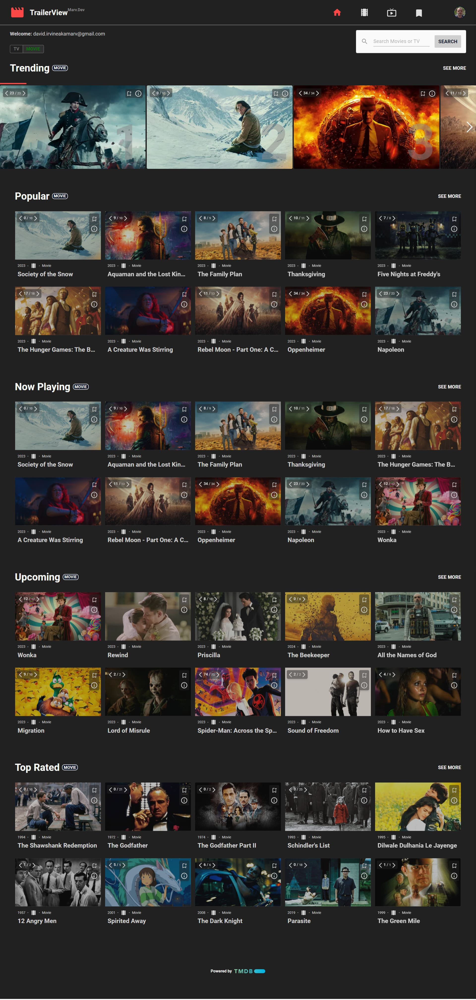
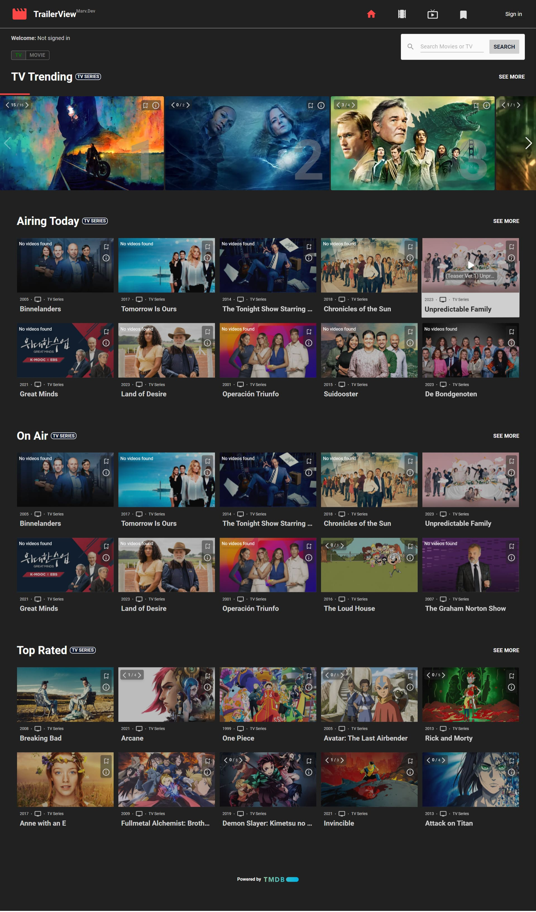
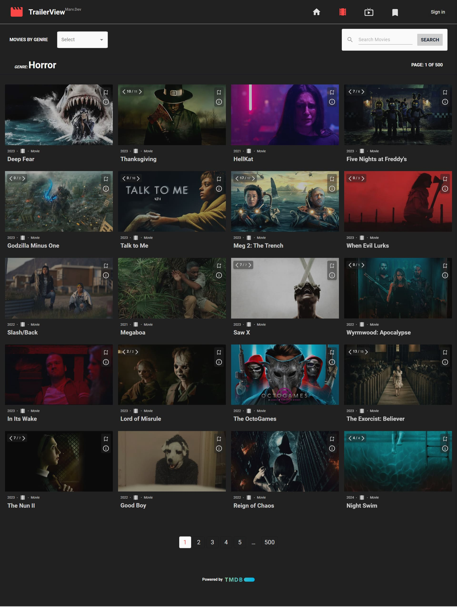
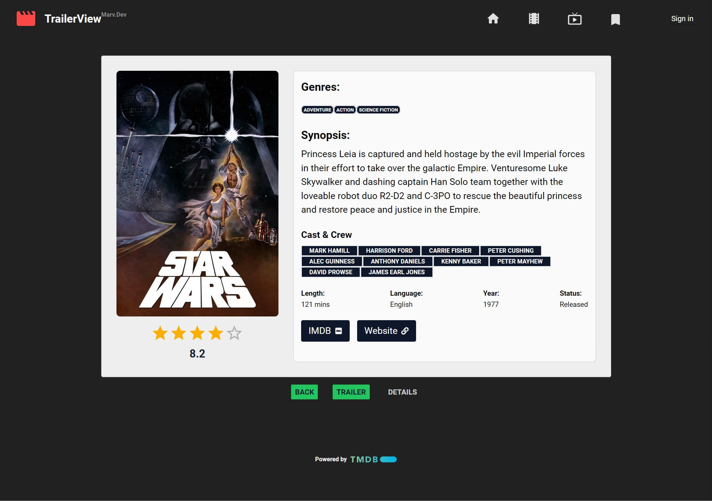
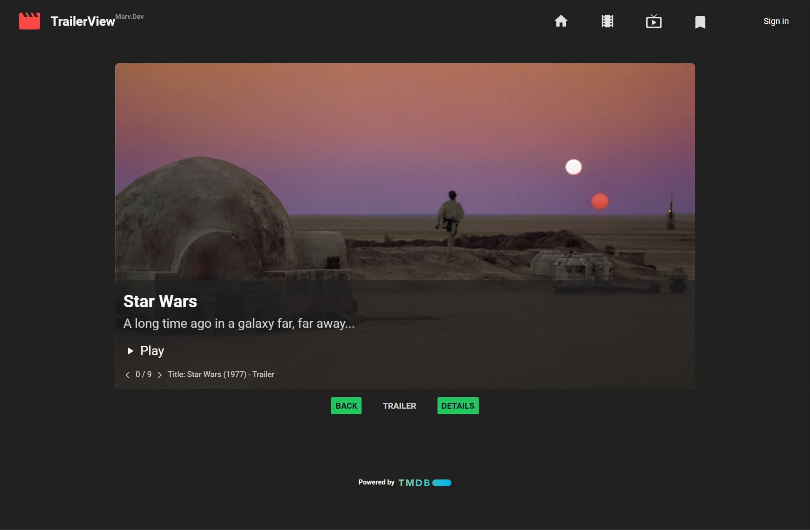

# TrailerView

TrailerView is an entertainment app for movie/TV buffs which grants immediate and full access across all collections and titles to TMDB's available Youtube content. Upon page load each content window has access to all currently available content; just use the next and prev buttons to browse and then click play to view.

Content of particular interest can be bookmarked and retrieved across devices. This feature is powered by NextAuth for user authentication and MongoDb for bookmark storage and retrieval. 

Powered by [TMDB](https://www.themoviedb.org/?language=en-US). Built with [Next.js 13](https://nextjs.org/). Deployed on [Vercel](https://vercel.com/new?utm_medium=default-template&filter=next.js&utm_source=create-next-app&utm_campaign=create-next-app-readme).
## To get started

If you want to improve upon this project just fork the repo add your code then submit a pull request, alternatively for a local copy, just clone the repo, simple! 

Then run the following:

```bash
npm install
# then run the dev server
npm run dev
# or
yarn dev
# or
pnpm dev
```

Open [http://localhost:3000](http://localhost:3000) with your browser to see TrailerView.

### Packages


TrailerView makes use of the following packages:

- [SwiperJS](https://swiperjs.com/)
- [materialUI](https://mui.com/material-ui/)
- [Radix-UI](https://www.radix-ui.com/)
- [MongoDbAtlas](https://www.mongodb.com/atlas/database)
- [NextJs-ProgressBar](https://www.npmjs.com/package/nextjs-progressbar)
- [React-Shimmer](https://www.npmjs.com/package/react-shimmer)
- [React-SocialMediaIcons](https://www.npmjs.com/package/react-social-icons)
- [ReactTilt](https://www.npmjs.com/package/react-tilt)
- [ReactToastify](https://www.npmjs.com/package/react-toastify)
- [ReactTooltip](https://www.npmjs.com/package/react-tooltip)
- [ReactYoutube](https://www.npmjs.com/package/react-youtube)
- [SWR](https://www.npmjs.com/package/swr)
- [RippleHook](https://www.npmjs.com/package/use-ripple-hook)
- [Tailwind](https://tailwindcss.com/)
- [NextAuth](https://next-auth.js.org/)


### TrailerView Screenshots

#### Homepage Movie


#### Homepage TV


#### Select Genre


#### Title Details


#### Title Video Content



#### Learn More

To learn more about Next.js, take a look at the following resources:

- [Next.js Documentation](https://nextjs.org/docs) - learn about Next.js features and API.
- [Learn Next.js](https://nextjs.org/learn) - an interactive Next.js tutorial.

You can check out [the Next.js GitHub repository](https://github.com/vercel/next.js/) - your feedback and contributions are welcome!

